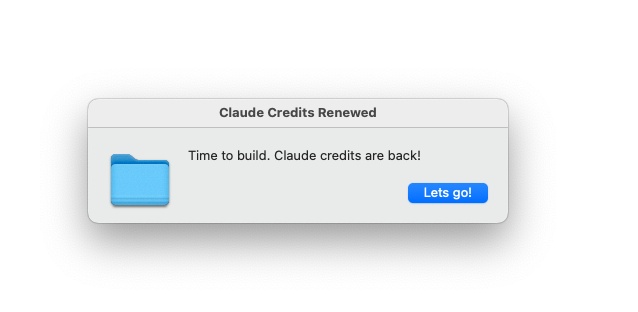

# claude-alarm

Never miss your Claude credit renewal. Get an automatic voice alert the moment your rate limit resets.

Works with all Claude subscriptions -- **Pro, Max, and any plan with rate limits**.

When you hit a Claude rate limit, `claude-alarm` detects it automatically through Claude Code hooks, starts a countdown, and speaks **"Time to build. Claude credits are back!"** when your credits renew -- with a desktop notification, a gentle chime, and a dismiss dialog.



## Setup (one time)

```bash
npm install -g claude-alarm
claude-alarm setup
```

Or without installing globally:

```bash
npx claude-alarm setup
```

That's it. Fully hands-free from here.

## How it works

1. `setup` installs hooks into Claude Code that monitor for rate limit events
2. When a rate limit is detected, a background countdown starts automatically
3. When the countdown ends, you get:
   - A desktop notification with a chime
   - A voice message: *"Time to build. Claude credits are back!"*
   - A persistent **"Let's go!"** dialog box to dismiss the alarm
4. Click **"Let's go!"** to dismiss -- the second repeat is cancelled
5. If not dismissed, the alert repeats once after 1 minute, then stops automatically
6. You can also dismiss from any terminal with `claude-alarm stop`

## Commands

| Command | Description |
|---|---|
| `claude-alarm setup` | One-time setup (installs hooks, tests alarm) |
| `claude-alarm start <time>` | Manual alarm: `4h`, `30m`, `60s`, or `240` (minutes) |
| `claude-alarm stop` | Dismiss an active alarm |
| `claude-alarm status` | Check if an alarm is active |
| `claude-alarm test` | Play a test alarm |
| `claude-alarm uninstall` | Remove all hooks and config |

## Platform support

| Platform | Notification | Voice | Dismiss dialog |
|---|---|---|---|
| macOS | osascript | `say` (Samantha) | AppleScript dialog |
| Linux | notify-send | espeak / spd-say | zenity / kdialog |
| Windows | PowerShell Toast | PowerShell Speech | MessageBox |

## Configuration

After setup, edit `~/.claude-alarm/config.json` to customize:

```json
{
  "displayMessage": "Time to build. Claude credits are back!",
  "spokenMessage": "Time to build. Clawed credits are back!",
  "voice": "Samantha",
  "rate": 165,
  "defaultWaitMinutes": 240
}
```

- **displayMessage**: Text shown in the notification and dialog
- **spokenMessage**: Text spoken aloud (spelled phonetically for correct pronunciation)
- **voice**: macOS voice name, or `espeak`/`spd-say` on Linux
- **rate**: Speech rate (words per minute)
- **defaultWaitMinutes**: Fallback countdown if reset time can't be detected (default: 4 hours)

> Works with Claude Pro, Claude Max, and any subscription tier that has rate limits. Detection is hook-based and tier-agnostic.

## How detection works

Claude Code has a hooks system that runs shell commands on events. `claude-alarm` installs hooks on two events:

- **Notification** -- triggered when Claude Code emits a system notification about rate limits
- **PostToolUseFailure** -- triggered when a tool call fails with a rate limit error (e.g. HTTP 429)

Both hooks receive structured data directly from Claude Code (not conversation content), so there are no false positives from talking about rate limits in chat. When either hook detects a rate limit, it extracts the reset time (or defaults to 4 hours) and spawns a background alarm process that survives terminal close.

## ntfy integration (optional)

Send a push notification via [ntfy](https://ntfy.sh) when credits renew. Useful for getting alerts on your phone or other devices.

Set these environment variables before running Claude Code:

```bash
export NTFY_TOPIC="my-claude-alarm"           # required to enable ntfy
export NTFY_URL="https://ntfy.sh"             # optional, defaults to https://ntfy.sh
export NTFY_PRIORITY="high"                   # optional
export NTFY_TAGS="rocket"                     # optional
```

Then subscribe to your topic in the ntfy app or web UI. When credits renew, you'll receive a push notification in addition to the local alerts.

## Uninstall

```bash
claude-alarm uninstall
```

Removes all hooks from Claude Code settings and deletes `~/.claude-alarm/`.

## Requirements

- Node.js >= 16 (already required by Claude Code)
- Claude Code CLI

## License

MIT
